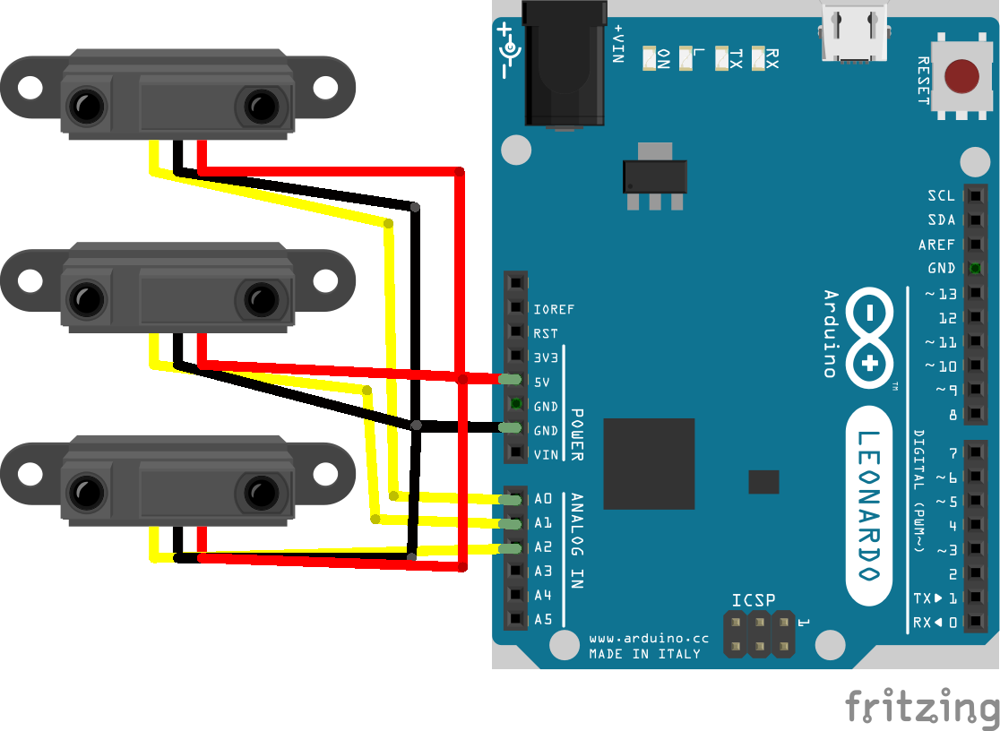

thereminIR
========

Arduino based infrared «theremin» midi controller

#### Materials

* Arduino (tested with leonardo ethernet)
* usb cable
* 3 x infrared range finder
	* Sharp [GP2Y0A21YK0F](http://www.robotshop.com/ca/en/sharp-gp2y0a21yk0f-ir-range-sensor.html) IR Range Sensor - 10cm to 80cm
	* 3 x [sensors wires](http://www.robotshop.com/ca/en/sirc-01-sharp-gp2-ir-sensor-cable-8.html)
* Headers
* Soldering iron

#### Schematic

Arduino wiring shematic

  

For XLR Wiring,  I Used this pin out

1 : gnd
2 : a0
3 : v++
4 : a1
5 : a2

#### Arduino
* Download and install the lastest version of the arduino IDE compatible with your board.  
* Download and install arcore from https://github.com/rkistner/arcore
	* Follow the installation method
	* tested with 1.7.8 at .org

#### Code structure

* Arduino / Serial Midi: Basic example to get raw data over serial bus
	* Use Max Msp patch to «see» the data after uploading to the board

* Arduino / Native Midi : Example usign Native midi over usb with Arcore

* Max : patch to see the data from the sensors
* pd : patch to hear the data from sensors
* schematic : fritzing schematic

#### References

##### Infrared theremin on the internet  
http://people.ece.cornell.edu/land/courses/ece4760/FinalProjects/f2013/sjm298_ar568/sjm298_ar568/sjm298_ar568/index.html
http://www.pyroelectro.com/projects/mini_ir_theremin/
http://bondoukousoftware.com/InfraredTheremin.html
http://atmega32-avr.com/infrared-theremin-using-atmega1284/

##### midi implementation
http://www.instructables.com/id/DIY-Arduino-Based-MIDI-Foot-Controller/?ALLSTEPS

##### alternative to arcore
https://github.com/adafruit/TeeOnArdu

##### Audio on arduino
http://playground.arduino.cc/Main/ArduinoSynth
http://makezine.com/projects/make-35/advanced-arduino-sound-synthesis/

##### Laser harp
http://harpelaserarduino.blogspot.ca
